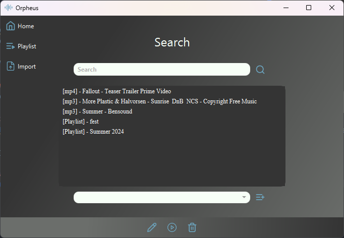

# Orpheus


## About

this is a simpel mediaplayer GUI, witch is able to play .mp3 & .mp4 files. 
Furthermore the mediaplayer is able to display the video encoded in .mp4 files. 

### Search View


### Playlist view


### Home View

to run the project simply follow the instructions in the `Installing and Usage` hedder. 

## Installing and Usage
```
    git clone https://github.com/eliastherkildsen/Orpheus
```
``` 
    The SqlServer database for the project is foundt add 
    path from src: db/dbMediaPlayerProd.bak
    
    1. Open the SQL Server Management Studio (SSMS).
    2. Right click on database symbole -> Restore Database...
    3. Select the databes directory where the .bak is stored  
    4. Restore
```
```
    import drivers into your project structur, see [dependencies] hedder.  
```

    


#### dependencies. 

`Java Database Connectivity` https://learn.microsoft.com/en-us/sql/connect/jdbc/download-microsoft-jdbc-driver-for-sql-server?view=sql-server-ver16 <br>
`Jthink` https://www.jthink.net/jaudiotagger/examples_id3.jsp <br>
`Javafx-mediaObj-18-win.jar` https://repo1.maven.org/maven2/org/openjfx/javafx-mediaObj/18-ea+2/ <br>
`Java MP4 Parser` https://github.com/sannies/mp4parser
